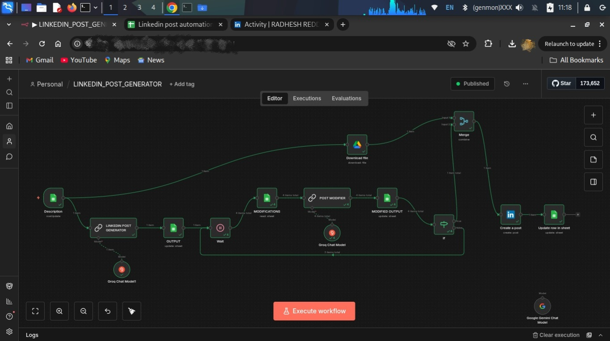

# 🚀 LinkedIn Post Automation Engine

 

An AI-powered LinkedIn content automation system built with **n8n**,
**Google Sheets**, and **LLM models** to streamline content generation,
approval workflows, and automatic publishing.

This project transforms manual LinkedIn posting into a structured,
scalable, and production-ready automation pipeline.

------------------------------------------------------------------------

## 📌 Overview

The LinkedIn Post Automation Engine enables:

-   Automated LinkedIn post generation using AI
-   Structured content storage in Google Sheets
-   Precision-based modification system
-   Manual approval control
-   Automatic LinkedIn publishing
-   Post-status tracking

Designed for creators, developers, startups, and personal brands who
want a repeatable, scalable LinkedIn content workflow.

## Workflow Architecture

------------------------------------------------------------------------

## 🏗️ System Architecture

### High-Level Workflow

    Google Sheets Trigger
            ↓
    AI Post Generator (LLM)
            ↓
    Store Initial Output
            ↓
    Modification Engine
            ↓
    Approval Gate (IF Logic)
            ↓
    Publish to LinkedIn
            ↓
    Update Status in Sheet

### Core Components

-   **n8n** -- Workflow automation engine
-   **Groq LLM / Gemini Model** -- AI content generation
-   **Google Sheets API** -- Content management
-   **LinkedIn API** -- Automated publishing
-   **Conditional Logic & Merge Nodes** -- Workflow orchestration

------------------------------------------------------------------------

## ⚙️ Workflow Node Breakdown

Below is a detailed explanation of each node used in the LinkedIn Post Automation workflow.

---

### 1️⃣ Description (Google Sheets Trigger)

**Purpose:**  
Monitors the Google Sheet for updates.

**What It Does:**
- Watches specific columns (PROJECT DESCRIPTION, GITHUB LINKS)
- Triggers the workflow when a row is updated
- Sends sheet data into the workflow pipeline

---

### 2️⃣ Download File (Google Drive Node)

**Purpose:**  
Fetches the image linked in the sheet.

**What It Does:**
- Reads IMAGE LINKS column
- Downloads the file from Google Drive
- Passes the media file for LinkedIn posting

---

### 3️⃣ LINKEDIN POST GENERATOR (LLM Chain)

**Purpose:**  
Generates structured LinkedIn content using AI.

**What It Does:**
- Reads PROJECT DESCRIPTION
- Reads GITHUB LINKS
- Analyzes project type and domain
- Generates:
  - Professional intro
  - Problem statement
  - Solution
  - Workflow explanation
  - Tools used
  - Hashtags
- Outputs structured LinkedIn-ready content

---

### 4️⃣ Groq Chat Model (AI Model)

**Purpose:**  
Acts as the language model powering the generator.

**What It Does:**
- Processes the prompt instructions
- Produces human-like LinkedIn post content
- Maintains professional formatting and tone

---

### 5️⃣ OUTPUT (Google Sheets Update Node)

**Purpose:**  
Stores the generated content in Google Sheets.

**What It Does:**
- Writes AI-generated post into the OUTPUT column
- Keeps row mapping consistent using row_number

---

### 6️⃣ Wait Node

**Purpose:**  
Creates a delay for modification handling.

**What It Does:**
- Waits for user to review the post
- Allows time for modifications to be added in sheet
- Prevents immediate publishing

---

### 7️⃣ MODIFICATIONS (Google Sheets Read Node)

**Purpose:**  
Reads user-requested changes.

**What It Does:**
- Fetches MODIFICATIONS column
- Sends both OUTPUT and MODIFICATIONS to the editor node

---

### 8️⃣ POST MODIFIER (LLM Chain)

**Purpose:**  
Applies precise edits without rewriting entire post.

**What It Does:**
- If MODIFICATIONS is empty → returns original OUTPUT
- If instructions exist → applies only specified changes
- Preserves structure, tone, emojis, and formatting

---

### 9️⃣ Groq Chat Model (Editor Model)

**Purpose:**  
Processes modification instructions.

**What It Does:**
- Applies minimal, precise changes
- Avoids adding new content unless requested

---

### 🔟 MODIFIED OUTPUT (Google Sheets Update Node)

**Purpose:**  
Stores final edited version.

**What It Does:**
- Writes refined content into MODIFIED OUTPUT column
- Prepares content for approval check

---

### 1️⃣1️⃣ IF Node (Approval Gate)

**Purpose:**  
Controls publishing logic.

**What It Does:**
- Checks if APPROVAL column equals "APPROVED"
- If TRUE → continue to publish
- If FALSE → loop back to Wait

---

### 1️⃣2️⃣ Merge Node

**Purpose:**  
Combines content and media.

**What It Does:**
- Merges modified text with downloaded image
- Prepares final payload for LinkedIn API

---

### 1️⃣3️⃣ Create a Post (LinkedIn Node)

**Purpose:**  
Publishes the LinkedIn post.

**What It Does:**
- Uses LinkedIn OAuth credentials
- Posts MODIFIED OUTPUT text
- Attaches downloaded image
- Publishes to personal LinkedIn account

---

### 1️⃣4️⃣ Update Row in Sheet

**Purpose:**  
Updates publishing status.

**What It Does:**
- Sets LINKEDIN STATUS = POSTED
- Marks completion of automation cycle

---

## 🔁 Complete Flow Summary

Google Sheet Update  
→ AI Post Generation  
→ Store Output  
→ Optional Modification  
→ Approval Check  
→ Publish to LinkedIn  
→ Update Status  

This ensures a controlled, automated, and production-ready LinkedIn publishing pipeline.

------------------------------------------------------------------------

## 📊 Google Sheet Schema

| Column              | Description                     |
|---------------------|---------------------------------|
| PROJECT DESCRIPTION | Base project information        |
| GITHUB LINKS        | Repository reference            |
| IMAGE LINKS         | Media attachment link           |
| OUTPUT              | Initial AI-generated content    |
| MODIFICATIONS       | Requested edits                 |
| MODIFIED OUTPUT     | Final approved version          |
| APPROVAL            | APPROVED / PENDING              |
| LINKEDIN STATUS     | POSTED / NOT POSTED             |

------------------------------------------------------------------------

## ⚙️ Key Features

### 🤖 AI-Driven Content Generation

Generates structured LinkedIn posts including: - Professional hook -
Problem statement - Solution approach - Workflow explanation - Tools &
technologies - Hashtags

### ✏️ Precision Editing Engine

Applies only explicit user-requested modifications without rewriting the
entire post.

### 🛡 Approval Workflow

Manual gate ensures content control before publishing.

### 🚀 Automated Publishing

Posts directly to LinkedIn once approved.

### 📈 Status Tracking

Updates Google Sheet after successful publishing.

------------------------------------------------------------------------

## 🧠 SEO Optimization Strategy

This project is optimized for GitHub discoverability using keywords such
as:

-   LinkedIn automation
-   AI content generation
-   n8n workflow automation
-   LinkedIn API integration
-   Social media automation system
-   LLM-powered content engine

------------------------------------------------------------------------

## 🔧 Tech Stack

-   n8n (No-code automation platform)
-   Google Sheets API
-   LinkedIn API
-   Groq Chat Model
-   Google Gemini
-   HTTP & Merge Nodes

------------------------------------------------------------------------
## ⚙️ Detailed Workflow Steps

- 1️⃣ Description Node

     Triggers the workflow with project details.
- 2️⃣ LinkedIn Post Generator

     Uses AI model to generate structured LinkedIn

 **CONTENT:**
- Hook line
- Problem
- Solution
- How it Works
- Tools Used

- 3️⃣ Output Storage

     Saves generated content into Google Sheets.
- 4️⃣ Modifications

     Reads modification requests from sheet and         regenerates refined output.
- 5️⃣ Approval Check (IF Node)

     If APPROVAL = APPROVED → Continue
Else → Goes to Wait Node and wait for the Approval.
- 6️⃣ Create LinkedIn Post

     Publishes the approved content directly to LinkedIn.
- 7️⃣ Update Row in Sheet

     Changes STATUS to POSTED in GOOGLE SHEETS.

------------------------------------------------------------------------

## 🔮 Future Roadmap

-   Scheduled auto-posting
-   Auto-generated image support
-   Analytics tracking dashboard
-   Multi-platform publishing (Twitter/X, Instagram)
-   Hashtag performance optimization

------------------------------------------------------------------------

## 📄 License

This project is licensed under the MIT License.

------------------------------------------------------------------------

## 👨‍💻 Author

Built with precision and automation mindset by\
**Radhesh Reddy Yarram**

------------------------------------------------------------------------

## ⭐ Support

If you find this project useful: - Star the repository - Fork and
improve it - Share it with your network

